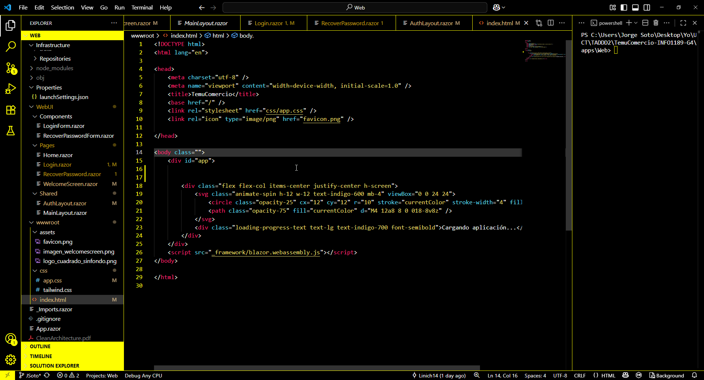
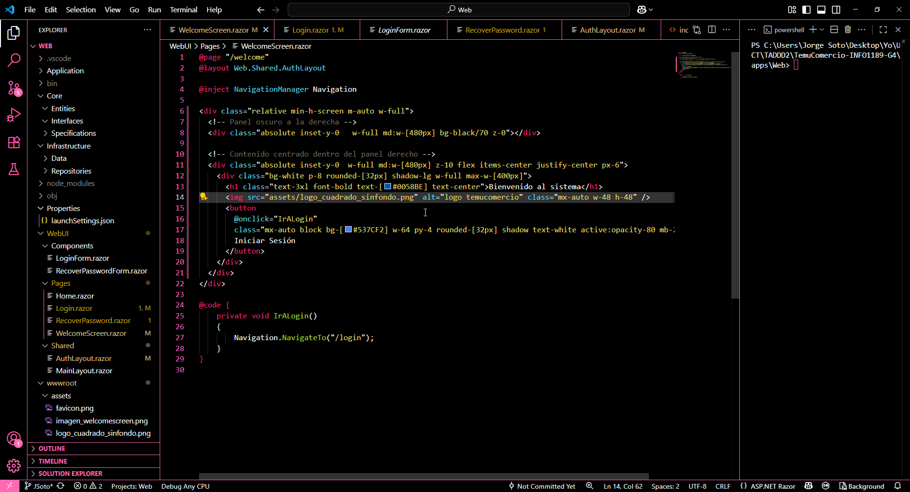

# highcontrast-lemonblush

## Overview
This project was created because, although there are several high contrast themes for VS Code, none fully matched my personal taste or visual comfort. Some had details in their color usage that didn't convince me, so I decided to make my own variants: one yellow and one pink. The focus is more on personal aesthetic and comfort than on universal visibility or experience.

## Screenshots

---

## Usage
To use the highcontrast-lemonblush themes in your editor:
1. Open the Command Palette (Ctrl+Shift+P).
2. Type `Preferences: Color Theme` and select it.
3. Choose either `High Contrast Lemon Blush Yellow` or `High Contrast Lemon Blush Pink` from the list.

## Contributing
Suggestions and improvements are welcome! Feel free to open an issue or submit a pull request.

## License
This project is licensed under the MIT License.